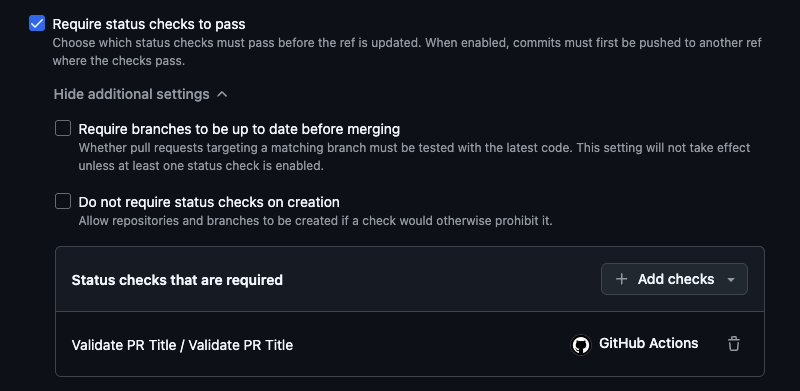

# Enforce Conventional Commits on PR titles

This workflow will ensure that your pull request's title matches the Conventional Commits specification. This format is often used to drive downstream workflows like automated versioning and changelogs.

This is intended for use with repositories that utilize Squash merges, as the title of the pull request is what lands on the base branch when a PR is merged. 

## Configuration

This workflow exposes several configuration items that you can supply through your repository's workflow invocation that will be passed through to the underlying [ytanikin/pr-conventional-commits](https://github.com/ytanikin/pr-conventional-commits) workflow:

| Configuration Key | Type                | Default Value                                                                                                                                                                                          | Notes                                                                                                                                                                                        |
|-------------------|---------------------|--------------------------------------------------------------------------------------------------------------------------------------------------------------------------------------------------------|----------------------------------------------------------------------------------------------------------------------------------------------------------------------------------------------|
| task_types        | string (JSON array) | ["feat","fix","docs","test","ci","refactor","perf","chore","revert"]                                                                                                                                   | Configures the valid prefixes for your commit message. Prefixes can be given a particular label by using the `custom_labels` setting below.                                                  |
| scope_types       | string (JSON array) | ""                                                                                                                                                                                                     | Valid scopes, e.g. `["login", "signup", "checkout", "payment"]`. If not supplied, any scope is valid.                                                                                        |
| title_regex       | string              | ""                                                                                                                                                                                                     | Regular expression to apply to the title. Typically this is used to validate a ticket number is included, e.g. `.+ JIRA-\d{3,6} .+`. If not specified, bypasses regular expression checking. |
| add_label         | boolean             | true                                                                                                                                                                                                   | Whether to add a label to the pull request with the type of the pull request.                                                                                                                |
| add_scope_label   | boolean             | true                                                                                                                                                                                                   | Whether to add a label to the pull request for the scope (if supplied).                                                                                                                      |
| custom_labels     | string (JSON map)   | {"feat": "feature", "fix": "fix", "docs": "documentation", "test": "test",<br>  "ci": "CI/CD", "refactor": "refactor", "perf": "performance", "chore": "chore",<br>  "revert": "revert", "wip": "WIP"} | A map of task_types and their stylized label text. With the default values, a task_type of `perf` will result in a label called `Performance`.                                               |

There are two additional configurations that are not passed to the underlying workflow, but control additional behaviors:

| Configuration Key  | Type    | Default Value | Notes                                                                                                                                                                                                                                                                                        |
|--------------------|---------|---------------|----------------------------------------------------------------------------------------------------------------------------------------------------------------------------------------------------------------------------------------------------------------------------------------------|
| comment_on_failure | boolean | true          | Whether to comment on the pull request if the title validation fails.                                                                                                                                                                                                                        |
| clear_labels       | boolean | true          | Whether to clear the existing labels on the pull request when the workflow is run. This helps clean up scope labels added by this action when the scope changes, as they persist if you rename your pull request and change the scope. If you have another labeling solution, turn this off. |


## Usage

To validate your PR titles using our default configuration, add the following workflow to your repository:

```yaml
name: Validate PR Title

on:
  pull_request:
    types: [opened, reopened, edited]

jobs:
  validate-title:
    name: Validate PR Title
    permissions:
      contents: read
      pull-requests: write
    uses: launchbynttdata/launch-workflows/.github/workflows/reusable-pr-conventional-commit-title.yml@ref
```

Be sure you replace `ref` with an appropriate ref to this repository.

> [!CAUTION]
> By default, your repository likely does not require this workflow to succeed before a change is merged. By making this workflow required, you ensure that a successful run must be achieved prior to merge, which ensures your commit messages are consistent!
> 
> To make this workflow required, visit your repository's settings and create a new Ruleset with a required status check, as shown below:



By doing so, you should see the `Required` indicator on your pull request's checks section, as shown below:


