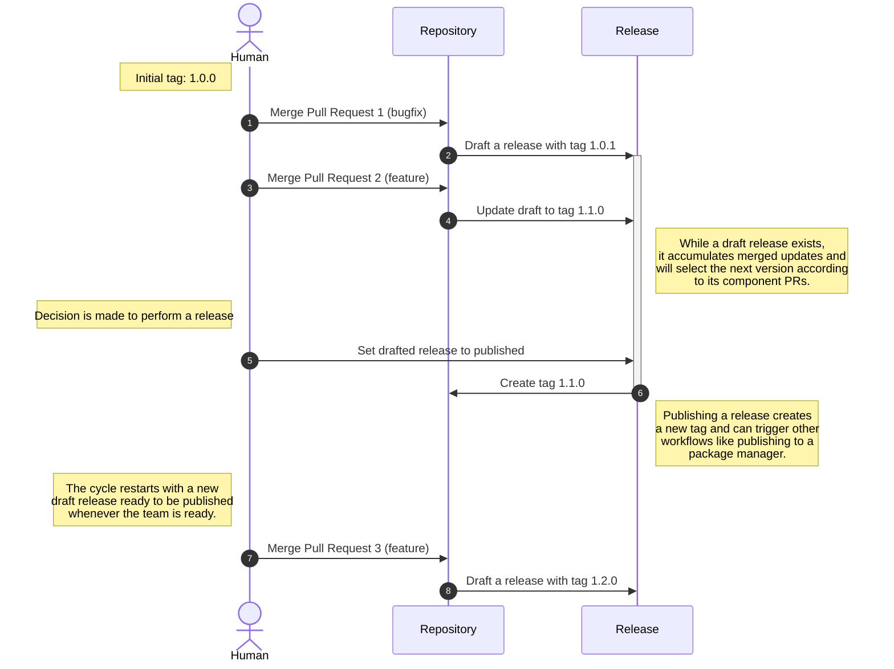

# Draft a Release on Merge to Main

> [!NOTE]
> This workflow uses [release-drafter](https://github.com/release-drafter/release-drafter) for most of the heavy lifting. The behaviors described here are a result of a release-drafter.yml configuration similar to [the one used in this repository](../.github/release-drafter.yml). This is a highly flexible workflow, and if you wish to deviate from our standard approach, a review of the capabilities and [configuration options](https://github.com/release-drafter/release-drafter?tab=readme-ov-file#configuration-options) is highly encouraged.

Creates a Draft release once a PR merges to the main branch. This workflow depends on your Pull Request having an appropriate Label applied to it, which is generally accomplished with something like our [PR labeling workflow](./reusable-pr-label-by-branch.md). Once the PR merges to the main branch, a workflow will run to create a Draft release and bump the version according to the PR(s) that have been merged since the last release.

This workflow is intended for use with software teams that don't release every single update to their codebase as a distinct version -- perhaps they use a cadence aligned with their sprints or quarterly releases -- the draft will aggregate the changes that have been made since the last release and will continually update the projected next version as PRs are merged. In order to release a new version of the software, someone will have to view the draft release and publish it.

The following diagram shows the state of the repository and tags as multiple pull requests are merged prior to a release.



## Usage

To utilize this reusable workflow, add a new workflow to your repository (suggested name: `.github/workflows/release-draft.yml`):

```yaml
name: Draft Release

on:
  push:
    branches:
      - main

permissions:
  contents: read

jobs:
  draft-release:
    name: "Draft Release on Merge"
    permissions:
      contents: write
      pull-requests: write
    uses: launchbynttdata/launch-workflows/.github/workflows/reusable-release-draft-on-merge.yml@ref
    secrets: inherit # pragma: allowlist secret
```

Be sure you replace `ref` with an appropriate ref to this repository.
