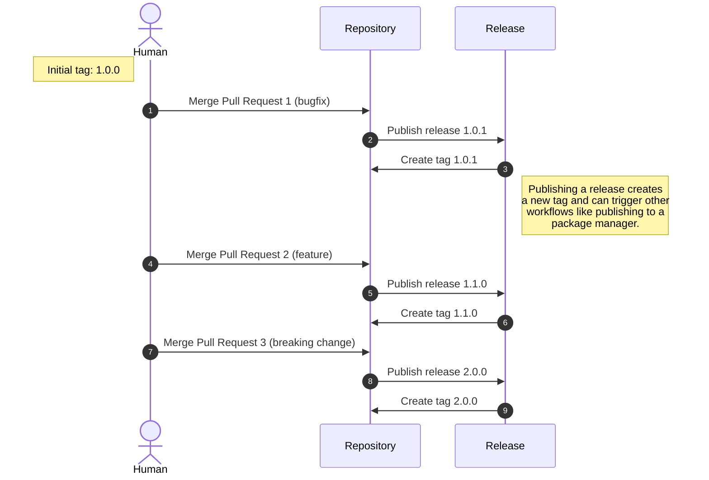

# Create and Publish a Release on Merge to Main

> [!NOTE]
> This workflow uses [release-drafter](https://github.com/release-drafter/release-drafter) for most of the heavy lifting. The behaviors described here are a result of a release-drafter.yml configuration similar to [the one used in this repository](../.github/release-drafter.yml). This is a highly flexible workflow, and if you wish to deviate from our standard approach, a review of the capabilities and [configuration options](https://github.com/release-drafter/release-drafter?tab=readme-ov-file#configuration-options) is highly encouraged.

Publishes a Release and corresponding tag for every PR that is merged to main. This workflow depends on your Pull Request having an appropriate Label applied to it, which is generally accomplished with something like our (the PR labeling workflow)[./reusable-pr-label-by-branch.md]. Once the PR merges to the main branch, a workflow will run to create and publish your release, which creates a new tagged version according to the PR that was just merged.

This workflow is intended for use with software teams that release every single merged PR as a unique version.



## Usage

To utilize this reusable workflow, add a new workflow to your repository (suggested name: `.github/workflows/release-publish.yml`):


```yaml
name: Publish Release

on:
  push:
    branches:
      - main

permissions:
  contents: read

jobs:
  release-on-merge:
    name: "Create and Publish Release on Merge"
    permissions:
      contents: write
      pull-requests: write
    uses: launchbynttdata/launch-workflows/.github/workflows/reusable-release-on-merge.yml@ref
    secrets: inherit # pragma: allowlist secret
```

Be sure you replace `ref` with an appropriate ref to this repository.
