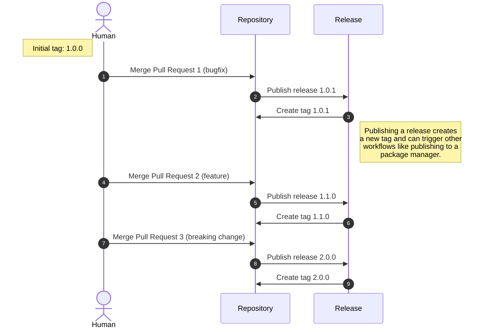

# Create and Publish a Release on Merge to Main

> [!NOTE]
> This workflow uses [release-drafter](https://github.com/release-drafter/release-drafter) for most of the heavy lifting. The behaviors described here are a result of a release-drafter.yml configuration similar to [the one used in this repository](../.github/release-drafter.yml). This is a highly flexible workflow, and if you wish to deviate from our standard approach, a review of the capabilities and [configuration options](https://github.com/release-drafter/release-drafter?tab=readme-ov-file#configuration-options) is highly encouraged.

Publishes a Release and corresponding tag for every PR that is merged to main. This workflow depends on your Pull Request having an appropriate Label applied to it, which is generally accomplished with something like our (the PR labeling workflow)[./reusable-pr-label-by-branch.md]. Once the PR merges to the main branch, a workflow will run to create and publish your release, which creates a new tagged version according to the PR that was just merged.

This workflow is intended for use with software teams that release every single merged PR as a unique version.


```mermaid
sequenceDiagram
  autonumber
  actor Human
  Note left of Human: Initial tag: 1.0.0
  Human->>Repository: Merge Pull Request 1 (bugfix)
  Repository->>Release: Publish release 1.0.1
  Release->>Repository: Create tag 1.0.1
  Note right of Release: Publishing a release creates<br /> a new tag and can trigger other<br/>workflows like publishing to a<br />package manager.
  Human->>Repository: Merge Pull Request 2 (feature)
  Repository->>Release: Publish release 1.1.0
  Release->>Repository: Create tag 1.1.0
  Human->>Repository: Merge Pull Request 3 (breaking change)
  Repository->>Release: Publish release 2.0.0
  Release->>Repository: Create tag 2.0.0
```

## Usage

To utilize this reusable workflow, add a new workflow to your repository (suggested name: `.github/workflows/release-publish.yml`):


```yaml
name: Publish Release

on:
  push:
    branches:
      - main

permissions:
  contents: read

jobs:
  release-on-merge:
    name: "Create and Publish Release on Merge"
    permissions:
      contents: write
      pull-requests: write
    uses: launchbynttdata/launch-workflows/.github/workflows/reusable-release-on-merge.yml@ref
    secrets: inherit # pragma: allowlist secret
```

Be sure you replace `ref` with an appropriate ref to this repository.

## Prerelease Workflow

This workflow supports a single prerelease approach, where:

- Passing a `prerelease_identifier` to the invocation will trigger a prerelease creation with a corresponding suffix
- Prereleases accumulate changes as they are merged

The suggested approach is to create and release a prerelease on merge to main, while also drafting the actual release for the next version, so that as soon as you're ready to release, you only have to publish the draft.

You might configure your repository with the following example workflow, replacing `ref` with an appropriate ref to this repository:

```yaml
name: Publish Prerelease

on:
  push:
    branches:
      - main

jobs:
  release-candidate-on-merge:
    name: "Create and Publish Prerelease on Merge"
    permissions:
      contents: write
      pull-requests: write
    uses: launchbynttdata/launch-workflows/.github/workflows/reusable-release-on-merge.yml@ref
    with:
      prerelease_identifier: "rc"
    secrets: inherit # pragma: allowlist secret

  release-draft-on-merge:
    name: "Draft Release on Merge"
    permissions:
      contents: write
      pull-requests: write
    uses: launchbynttdata/launch-workflows/.github/workflows/reusable-release-on-merge.yml@ref
    with:
      publish: false
    secrets: inherit # pragma: allowlist secret

```

From a starting point of 1.0.0, a pull request labeled for a patch version update upon merge will:

- Create a prerelease for version 1.0.1-rc0
- Create a draft release for version 1.0.1

If another pull request for a patch version update is merged before the draft is made public, another prerelease will be created and the following will exist:

- 1.0.1-rc0 (prerelease)
- 1.0.1-rc1 (prerelease, latest)
- 1.0.1 (still drafted)

Assuming the draft remains and a PR for a minor version is merged, the RC tag is moved forward and the draft is updated to the proper version:

- 1.0.1-rc0 (our first PR)
- 1.0.1-rc1 (no longer latest)
- 1.1.0-rc0 (still a prerelease, latest)
- 1.1.0 (our original draft is renamed and its body is updated)

## Inputs

| Input | Type | Required | Default | Description |
|-------|------|----------|---------|-------------|
| `config_name` | `string` | No | `release-drafter.yml` | The name of the release drafter config file to use. |
| `commitish` | `string` | No | `main` | The release target, i.e. the branch or commit the release should point to. |
| `latest` | `boolean` | No | `true` | Whether this release should be marked as the latest release. |
| `disable_autolabeler` | `boolean` | No | `true` | Whether to disable the autolabeler. Should remain disabled if pull requests are labeled by another workflow. |
| `prerelease_identifier` | `string` | No | `""` (empty) | The identifier to use for prereleases, e.g. `rc` or `beta`. When set, the release is marked as a prerelease and the tag is suffixed with this identifier. |
| `publish` | `boolean` | No | `true` | Whether to publish the release immediately. When `false`, the release is created as a draft. |

## Outputs

| Output | Description |
|--------|-------------|
| `release_version` | The tag name of the release created by this workflow. |
