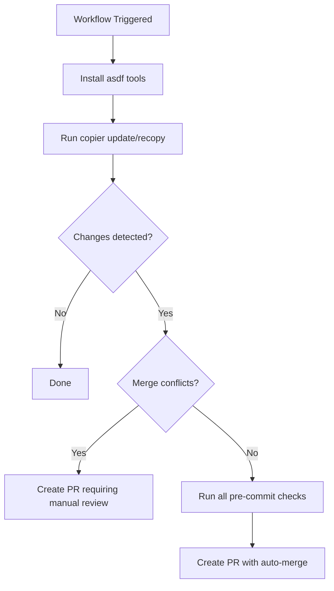

# Update Repository from Skeleton

Keeps a repository in sync with its upstream [Copier](https://copier.readthedocs.io/) skeleton template. When triggered, the workflow runs `copier update` (or `copier recopy`) against the repository, detects changes, validates them with pre-commit, and opens a pull request with the result.



## Behavior

1. **Tool installation** — Installs tools defined in the repository's `.tool-versions` file via asdf (with caching), then installs Copier and pre-commit via uv.
2. **Copier update** — Runs `copier update --defaults --trust` to pull the latest changes from the skeleton template. If the repository's `prerelease` custom property is `true`, the `--prerelease` flag is added to pick up prerelease skeleton versions.
3. **Recopy mode** — When `recopy` is set to `true`, runs `copier recopy --defaults --trust --overwrite` instead, which overwrites all templated files. Recopy PRs always require manual review.
4. **Pre-commit validation** — If a `.pre-commit-config.yaml` exists, validation runs in two phases:
   - First, `check-merge-conflict` runs against all files. If merge conflict markers are found, the PR is flagged for manual review.
   - If no conflicts are found, all pre-commit hooks run against all files. Any automatic fixes (formatting, trailing whitespace, etc.) are included in the resulting commit.
5. **Pull request creation**:
   - If pre-commit passes and recopy is not enabled, a PR titled `chore: update from skeleton` is created with auto-merge enabled.
   - If pre-commit fails (merge conflicts) or recopy is enabled, a PR titled `fix: update from skeleton` is created and flagged for manual review. Any files with merge conflict markers are listed in the PR body.

## Usage

Add the following workflow to your repository (suggested name: `.github/workflows/update-from-skeleton.yml`):

```yaml
name: Update from Skeleton

on:
  schedule:
    - cron: "0 6 * * 1" # Weekly on Monday at 6:00 UTC
  workflow_dispatch:
    inputs:
      recopy:
        description: "Perform a full recopy instead of an incremental update"
        type: boolean
        default: false

permissions:
  contents: write
  pull-requests: write

jobs:
  update-from-skeleton:
    name: Update from Skeleton
    permissions:
      contents: write
      pull-requests: write
    uses: launchbynttdata/launch-workflows/.github/workflows/reusable-update-from-skeleton.yml@ref
    with:
      recopy: ${{ github.event.inputs.recopy == 'true' }}
    secrets: inherit
```

Be sure you replace `ref` with an appropriate ref to this repository.

## Inputs

| Input | Description | Required | Default |
|-------|-------------|----------|---------|
| `recopy` | Perform a full recopy instead of an incremental update. Overwrites all templated files and re-runs tasks defined in `copier.yml`. The resulting PR will require manual review. | No | `false` |
| `skeleton_update_app_id` | The GitHub App ID of the app used for authentication when pushing updates. | No | `${{ vars.LAUNCH_SKELETON_UPDATE_APP_ID }}` |

## Required Secrets and Variables

| Name | Type | Description |
|------|------|-------------|
| `LAUNCH_SKELETON_UPDATE_APP_ID` | Variable | The GitHub App ID for the skeleton update app. |
| `LAUNCH_SKELETON_UPDATE_KEY` | Secret | The private key for the skeleton update app. |

The GitHub App must be installed on the repository with permissions to read and write code and create pull requests.
